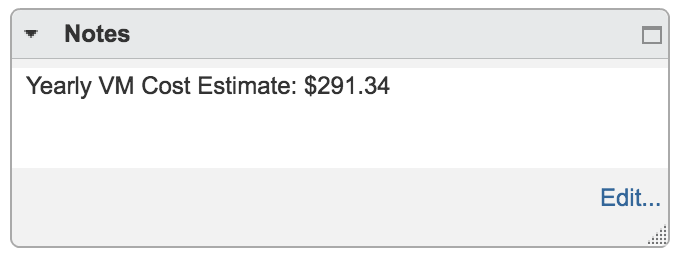

# vsphere-showback

Enumerates all VMs and calculates their cost which is then added to each VMs notes field in vCenter.
All VMs are then also output to a timestamped CSV file as well for trending reporting and history.
This allows you to estimate your per workload/VM costs in a cloud-like manner even when you capitalize
your infrastructure costs over a period of time. Even when you operationalize (lease) or a mix of both
this tool should work as well assuming you can get all of your individual costs down to a monthly amount.

## Installation

Requires VMware PowerCLI to be installed on the host running the script. See: www.vmware.com/go/powercli

## Screenshot



## Usage

Requires a vCenter Credentials file "vCenter.cred" created using the VICredentialStoreItem tool:
```
New-VICredentialStoreItem -host vcenter-host.domain.com -user username -password ****** -file
```

Schedule nightly (or less frequently) using Windows Task Scheduler or similar:
```
C:\Windows\system32\WindowsPowerShell\v1.0\powershell.exe -PSConsoleFile "C:\Program Files (x86)\VMware\Infrastructure\vSphere PowerCLI\vim.psc1" "& "C:\ScriptPath\vsphere-showback.ps1" >logfile.log
```

### Cost Calculator Tool
An Excel format calculator tool `Infra-Cost-Calc-Tool.xslx` is included to help determine your monthly per-host and/or per-VM costs from a more traditional spend (such as the typical 3-year capitalized hardware with 3-year operationalized support model)

## History

17-Feb-2017: Initial script

## Credits

Written by: Anthony Siano

## License

MIT License
